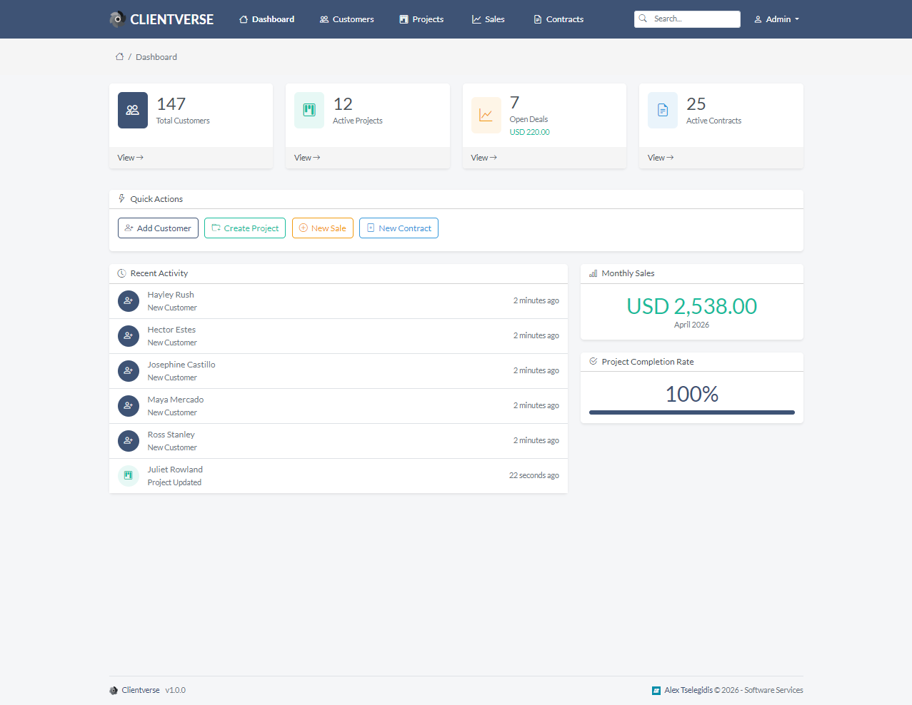

<h1 align="center">
    <br>
    <a href="https://github.com/alextselegidis/clientverse">
        
    </a>
    <br>
    Clientverse
    <br>
</h1>

<br>

<h4 align="center">
    An efficient CRM that can be installed on your server. 
</h4>

<p align="center">
  
  
  
</p>

<p align="center">
  <a href="#about">About</a> •
  <a href="#features">Features</a> •
  <a href="#setup">Setup</a> •
  <a href="#installation">Installation</a> •
  <a href="#seeding-demo-data">Seeding Demo Data</a> •
  <a href="#license">License</a>
</p>



## About

**Clientverse** is a modern CRM application designed for clarity, control, and efficiency. Managing clients, projects, 
and relationships takes care and structure—especially as your business grows. With Clientverse, you get a real-time 
overview of your customers, interactions, and ongoing work, helping you stay organized, informed, and always one step 
ahead.

## Features

The application allows you to manage and organize your clients, contacts, and customer relationships in one centralized system.

## Setup

To clone and run this application, you'll need Docker installed on your computer. From your command line:

```bash
# Clone this repository
$ git clone https://github.com/alextselegidis/clientverse.git

# Go into the repository
$ cd clientverse

# Install dependencies
$ docker compose up -d
```

Then you can SSH into the PHP-FPM container and install the dependencies with `composer install`. 

Note: the current setup works with Windows and WSL & Docker.

You can build the files by running `bash build.sh`. This command will bundle everything to a `build.zip` archive.

## Installation

You will need to perform the following steps to install the application on your server:

* Make sure that your server has Apache/Nginx, PHP (8.2+) and MySQL installed.
* Create a new database (or use an existing one).
* Copy the "clientverse" source folder on your server.
* Make sure that the "storage" directory is writable.
* Rename the ".env.example" file to ".env" and update its contents based on your environment.
* Run the `php artisan migrate:fresh` command from the terminal. 
* Open the browser on the Clientverse URL and log in with admin@example.org and 12345678 as the password. 

That's it! You can now use Clientverse at your will.

## Seeding Demo Data

Clientverse ships with a dedicated `DemoSeeder` that populates the database with
a realistic dataset for an IT services / managed support company. It is useful
for evaluating the application, recording demos, or developing against a fully
populated CRM.

The seeder generates approximately:

* 100 corporate customers across 15 industries (with VAT IDs, addresses,
  currencies and metadata)
* 2–5 contacts per customer (decision maker, finance, technical, etc.)
* A sales pipeline of 1–3 opportunities per customer with coherent stages
  and probabilities
* Projects, milestones and signed contracts derived from "won" sales
* Customer notes, tags, project teams and file metadata
* ~12 internal staff users (account managers, engineers, project managers)

> **Important:** `DemoSeeder` is **not** registered in `DatabaseSeeder.php` and
> will **never** run during a normal `php artisan db:seed`. It is opt-in and
> must be invoked explicitly.

### Run the seeder

From the project root (or inside the PHP-FPM container if you use Docker):

```bash
# Seed demo data into an existing database
php artisan db:seed --class=DemoSeeder

# Reset the database and load demo data in one shot
php artisan migrate:fresh --seed --seeder=DemoSeeder
```

### Demo credentials

* The default admin user (`admin@example.org` / `12345678`) is preserved.
* Generated staff users use the email pattern
  `firstname.lastname@clientverse-demo.test` and the password `password`.

### Resetting

To wipe demo data and start over, run `php artisan migrate:fresh` followed by
either the regular installer steps or the `DemoSeeder` command above.

You will find the latest release at [github.com/alextselegidis/clientverse](github.com/alextselegidis/clientverse).
You can also report problems on the [issues page](https://github.com/alextselegidis/clientverse/issues)
and help the development progress.

## License

Code Licensed Under [GPL v3.0](https://www.gnu.org/licenses/gpl-3.0.en.html) | Content Under [CC BY 3.0](https://creativecommons.org/licenses/by/3.0/)

---

Website [alextselegidis.com](https://alextselegidis.com) &nbsp;&middot;&nbsp;
GitHub [alextselegidis](https://github.com/alextselegidis) &nbsp;&middot;&nbsp;
Twitter [@alextselegidis](https://twitter.com/AlexTselegidis)

###### More Projects On Github
###### ⇾ [Plainpad &middot; Self Hosted Note Taking App](https://github.com/alextselegidis/plainpad)
###### ⇾ [Easy!Appointments &middot; Online Appointment Scheduler](https://github.com/alextselegidis/easyappointments)
###### ⇾ [Integravy &middot; Service Orchestration At Your Fingertips](https://github.com/alextselegidis/integravy)

